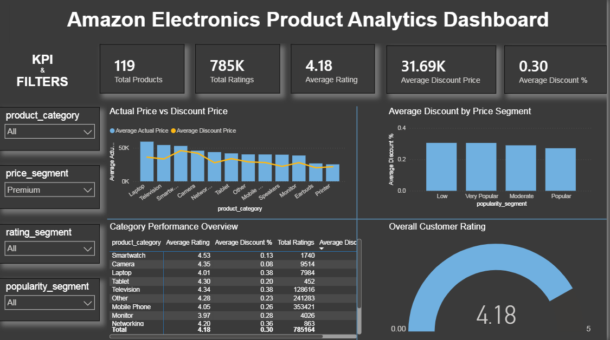

# Amazon Electronics Product & Pricing Analytics Dashboard

### Interactive Business Intelligence Project using Excel, MySQL, Power BI & DAX

---

## Project Overview

This project focuses on analyzing Amazon electronics product data to understand product pricing, discounts, customer ratings, customer engagement, and overall product performance.

The project follows a complete data analytics workflow — starting with raw data preparation in Microsoft Excel, followed by data cleaning and validation using MySQL, and finally transforming the cleaned data into an interactive Power BI dashboard built with DAX.

The objective is not only to visualize the data but also to convert raw product information into meaningful business insights that support pricing analysis, product evaluation, and data-driven decision-making.

---

## Business Problem

E-commerce platforms contain a large amount of product information, but raw product data is often difficult to analyze directly.

The dataset contains information about:

- Product names
- Product ratings
- Number of ratings
- Discounted prices
- Actual/original prices
- Product categories

However, simply looking at the raw data does not easily answer important business questions such as:

- Which product categories have the highest number of products?
- What is the average customer rating?
- Which products receive the most customer engagement?
- How much discount is generally offered?
- How do actual prices compare with discounted prices?
- Which products are highly rated?
- Does product price appear to be related to customer ratings?
- Which product segments perform better?

This project was developed to answer these questions through an interactive analytics dashboard.

---

## Project Objectives

The major objectives of this project are:

1. Clean and validate the raw Amazon electronics dataset.
2. Ensure that numerical fields such as prices, ratings, and number of ratings are correctly formatted.
3. Identify and handle data-quality issues.
4. Store and validate the cleaned data using MySQL.
5. Develop analytical measures using DAX.
6. Build an interactive Power BI dashboard.
7. Analyze pricing and discount patterns.
8. Analyze customer ratings and engagement.
9. Identify highly rated and popular products.
10. Present business-oriented insights through data visualization.

---

## Tools & Technologies

| Tool | Purpose |
|---|---|
| Microsoft Excel | Initial data inspection and cleaning |
| MySQL Workbench | Data cleaning, validation, and storage |
| Power BI Desktop | Data visualization and dashboard development |
| DAX | KPI and analytical calculations |
| GitHub | Project documentation and portfolio |

---

## Dataset

The dataset contains Amazon electronics product-level information.

### Main Columns Used

| Column | Description |
|---|---|
| `name` | Product name |
| `ratings` | Customer rating of the product |
| `no_of_ratings` | Number of customer ratings |
| `discount_price` | Discounted/current product price |
| `actual_price` | Original product price |
| `product_category` | Product category |
| `price_segment` | Price-based product segment |
| `rating_segment` | Rating-based segment |
| `popularity_segment` | Popularity/customer-engagement segment |

The final dataset contains **5,300+ product records**.

---

## Complete Project Workflow

The project was completed through the following stages:

```text
Raw Dataset
     ↓
Microsoft Excel
     ↓
Data Cleaning
     ↓
Data Validation
     ↓
MySQL
     ↓
SQL Data Verification
     ↓
CSV Export
     ↓
Power BI
     ↓
Power Query
     ↓
DAX Measures
     ↓
KPIs & Filters
     ↓
Data Visualization
     ↓
Interactive Dashboard
     ↓
Business Insights
```

---

## Data Cleaning & Preparation

Before loading the data into MySQL, the raw dataset was inspected and cleaned in Excel and Power Query. Key steps included:

- Removing duplicate and irrelevant records
- Standardizing text fields (product names, categories)
- Converting price fields into proper numeric format
- Converting ratings and number of ratings into numeric format
- Handling missing or null values
- Creating derived segment columns (`price_segment`, `rating_segment`, `popularity_segment`)

---

## MySQL: Data Validation & Storage

The cleaned dataset was loaded into MySQL Workbench to:

- Validate data types and column integrity
- Run exploratory SQL queries to confirm data quality
- Cross-check totals, ranges, and category counts
- Export the finalized, validated dataset as a CSV for Power BI

---

## Dashboard Preview



---

## Power BI: Dashboard Development

The validated dataset was imported into Power BI Desktop, where Power Query was used for final transformations and DAX was used to build analytical measures. The dashboard includes KPIs, slicers/filters, and visualizations designed to answer the business questions outlined above.

### Key Metrics & Visuals

- Total products, average rating, and average discount KPIs
- Product distribution by category
- Price comparison: actual price vs. discounted price
- Rating distribution across products
- Popularity/engagement analysis based on number of ratings
- Price vs. rating relationship analysis
- Performance breakdown by price, rating, and popularity segments

---

## Key Business Insights

- Certain product categories dominate the overall product count, indicating market concentration.
- A majority of products carry moderate to high discounts, suggesting an aggressive pricing strategy across the platform.
- Products with a higher number of ratings do not always correspond to the highest price points, indicating popularity is driven more by value than by cost.
- Rating segments reveal that most products cluster around good-to-excellent ratings, with fewer poorly rated products.
- Price and rating do not show a strong direct relationship, suggesting that pricing alone is not the primary driver of customer satisfaction.

---

## Project Structure

```text
amazon-electronics-product-analytics/
├── data/
├── screenshots/
├── Amazon Electronics Product Analytics Dashboard.pbix
├── data_cleaning.sql
└── README.md
```

---

## How to Use This Project

1. Clone or download this repository.
2. Review the source data inside the `data/` folder.
3. Run `data_cleaning.sql` against MySQL to reproduce the data cleaning and validation steps.
4. Open `Amazon Electronics Product Analytics Dashboard.pbix` in Power BI Desktop to explore the interactive dashboard.
5. Refer to the `screenshots/` folder for a quick preview of the dashboard without opening Power BI.
6. Use the slicers and filters within the dashboard to explore categories, price segments, and rating segments.

---

## Conclusion

This project demonstrates an end-to-end data analytics workflow — from raw data cleaning in Excel, through validation and storage in MySQL, to building an interactive, insight-driven dashboard in Power BI using DAX. It highlights how raw e-commerce product data can be transformed into actionable business insights around pricing, discounting, and customer engagement.

---

## Author

Feel free to connect or reach out with questions or feedback about this project.
